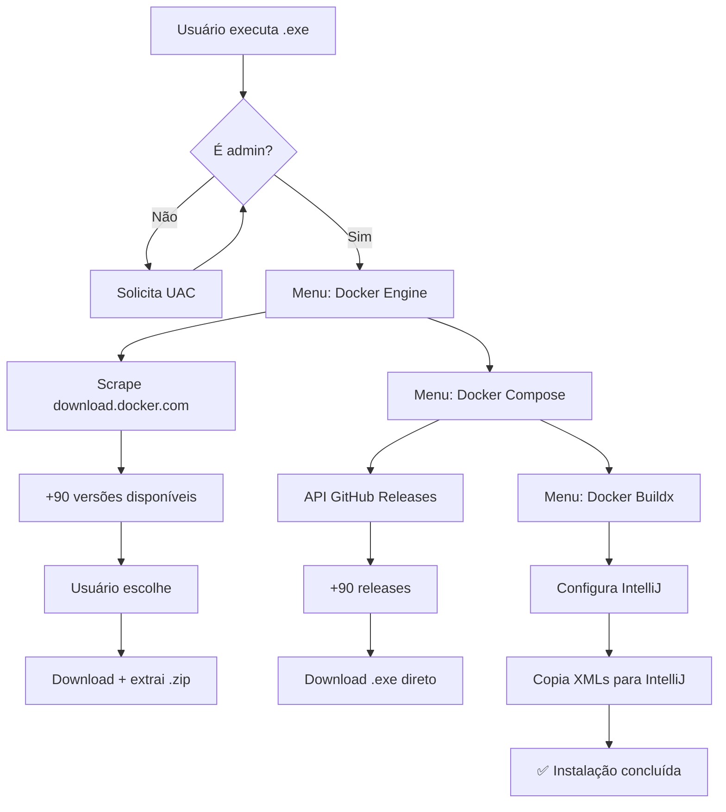

<p align="center">
  
  &nbsp;&nbsp;
  
</p>

<h1 align="center">🐳 Docker sem Docker Desktop</h1>
<h3 align="center">Instalador CLI do Docker + Integração IntelliJ IDEA</h3>

<p align="center">
  
  
  
  
</p>

<p align="center">
  <b>🇧🇷 Interface 100% em português &nbsp;|&nbsp; ⚡ Download direto das fontes oficiais</b>
</p>

---

## 🤔 Por que isso existe?

O **Docker Desktop** é pesado, consome RAM, exige licença comercial para empresas com +250 funcionários, e força um monte de recursos que você nunca usa.

Se você só precisa do **Docker CLI** (docker, docker compose, docker buildx) para rodar containers **via terminal** e integrar com o **IntelliJ IDEA** — este instalador resolve em 2 minutos.

|  | Docker Desktop | **Este instalador** |
|---|---|---|
| Peso em disco | ~4 GB | ~150 MB |
| RAM em idle | 400-800 MB | 0 MB |
| Licença | Paga (empresas 250+) | **Grátis** |
| Updates | Forçados | Você escolhe a versão |
| UI gráfica | Sim | Não (terminal + IntelliJ) |
| WSL obrigatório | Sim | **Não** |

---

## ✨ Funcionalidades

```
╔══════════════════════════════════════════════════════════════╗
║  DOCKER ENGINE - Escolha a Versão                            ║
║  ══════════════════════════════════════════════════════════  ║
║                                                              ║
║  [ 0]  29.6.2  (45 MB)      ★ MAIS RECENTE ★                ║
║                                                              ║
║  [ 1]  29.6.1  (45 MB)   [14]  28.3.2  (41 MB)  ...          ║
║  [ 2]  29.6.0  (45 MB)   [15]  28.3.1  (41 MB)               ║
║  ...                                                         ║
║                                                              ║
║  [A] Atualizar  [S] Sair  [0] Mais recente                   ║
║  ─────────────────────────────────────────────────────────   ║
║  > 0                                                         ║
╚══════════════════════════════════════════════════════════════╝
```

- 🎯 **Menu interativo** — escolha entre +90 versões do Docker Engine (da 17.06 à 29.6)
- 🚀 **Download direto** — binários oficiais de `download.docker.com` e GitHub Releases
- 🎨 **Terminal colorido** — ANSI colors, spinners animados, barra de progresso em tempo real
- 🔌 **IntelliJ IDEA** — configura automaticamente `docker-tools.xml` e `remote-servers.xml`
- 🧩 **Docker Compose** — menu próprio com dezenas de releases do GitHub
- 🏗️ **Docker Buildx** — plugin multi-plataforma com menu de versões independente
- 🛡️ **Sem bloat** — zero serviços em background, zero WSL, zero VMs

---

## 🚀 Uso rápido

### Opção 1: `.exe` prontinho (recomendado)

1. Baixe o [`Instalador-Docker.exe`](https://github.com/seu-usuario/docker-intellij-installer/releases/latest) da página de Releases
2. Execute (duplo clique) — **pede UAC** (precisa admin)
3. Escolha as versões nos menus interativos
4. Pronto! `docker --version` já funciona

### Opção 2: Rodar via Python

```powershell
git clone https://github.com/seu-usuario/docker-intellij-installer.git
cd docker-intellij-installer
python main.py
```

> **Pré-requisito:** Python 3.11+ (sem dependências externas — usa só a biblioteca padrão!)

---

## 📁 O que é instalado

```
  ├── docker.exe            ← Docker Engine (do site oficial)
  ├── dockerd.exe           ← Docker Daemon
  ├── docker-proxy.exe      ← Proxy de rede
%USERPROFILE%\.docker-cli\
  ├── docker.exe            ← Docker Engine (do site oficial)
  ├── dockerd.exe           ← Docker Daemon
  ├── docker-proxy.exe      ← Proxy de rede
  ├── containerd.exe        ← Container runtime
  └── docker-compose.exe    ← Docker Compose (do GitHub)

%USERPROFILE%\.docker\cli-plugins\
  └── docker-buildx.exe     ← Docker Buildx (do GitHub)
```

---

## 🔧 Como funciona



---

## 🎮 Teclas do menu

| Tecla | Ação |
|---|---|
| `0` | Seleciona a versão mais recente (recomendada) |
| `N` | Seleciona a versão pelo número exibido |
| `A` | Atualiza a lista de versões (busca no site novamente) |
| `S` | Sai / Pula componente |

---

## ❓ FAQ

<details>
<summary><b>Preciso do Docker Desktop instalado?</b></summary>
Não! O Docker Desktop <b>não</b> é necessário. O instalador baixa apenas os binários CLI oficiais. Você precisa de um <b>Docker Engine</b> rodando em algum lugar (localhost, WSL, servidor remoto) para conectar.
</details>

<details>
<summary><b>Como conectar no Docker Engine local?</b></summary>
O IntelliJ já é configurado para <code>npipe:////./pipe/docker_engine</code> (Docker no Windows). Se você usa Docker no WSL, ajuste para <code>tcp://localhost:2375</code>.
</details>

<details>
<summary><b>Funciona no Windows 10?</b></summary>
Sim! Windows 10 build 16257+ (qualquer build recente). As cores ANSI funcionam nativamente.
</details>

<details>
<summary><b>Posso atualizar depois?</b></summary>
Execute o instalador novamente e escolha uma versão mais nova. Ele sobrescreve os binários em <code>C:\Docker-CLI</code>.
</details>

<details>
<summary><b>O instalador coleta dados?</b></summary>
<b>Zero.</b> Não tem analytics, telemetria, ou qualquer chamada externa além dos downloads oficiais do Docker/GitHub.
</details>

---

## 🛠️ Gerar o `.exe`

```powershell
pip install pyinstaller
pyinstaller --onefile --clean --name "Instalador-Docker" main.py
# .exe em dist/
```

---

## 🤝 Contribuindo

PRs são muito bem-vindos! Áreas que aceitam contribuição:

- 🐛 Report de bugs
- 🌐 Tradução (inglês, espanhol...)
- 🪟 Suporte a mais IDEs (VS Code, Rider...)
- 🍎 Suporte a macOS / Linux

Abra uma issue antes de começar — assim alinhamos expectativas.

---

## 📜 Licença

MIT © 2026 — Faça o que quiser.

---

<p align="center">
  <sub>Feito para a comunidade Docker que cansou do Docker Desktop</sub>
</p>

---